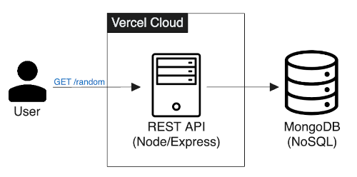

# Llama as a Service (LaaS) API 

[](https://github.com/llama-as-a-service/images-service/actions/workflows/ci.yml) [](https://github.com/llama-as-a-service/images-service/actions/workflows/vercel-deploy.yml) [](https://github.com/llama-as-a-service/images-service/actions/workflows/publish-to-ghcr.yml) [](https://img.shields.io/github/v/tag/llama-as-a-service/images-service) [](https://img.shields.io/github/v/tag/llama-as-a-service/images-service?color=%233D9970)

API for random Llama images. The world's first Llama as a Service (LaaS) - by @spencerlepine

Built with Node.js / Express, and MongoDB (NoSQL Database). Deployed to a serverless endpoint hosted on Vercel

> ⚠️ Production API has been deprecated

#### ✅ Try It Out:

```sh
curl https://llama-as-a-service.vercel.app/random
```

##### Sampe Response (JSON)

```json
{
  "message": "https://images.theconversation.com/files/337593/original/file-20200526-106811-ql6d51.jpg?ixlib=rb-1.1.0&q=45&auto=format&w=1200&h=900.0&fit=crop"
}
```

## 🏗️ Architecture

> ⚠️ Returns URL strings for images hosted on third-party CDNs



## Tech Stack

- Node.js / Express
- MongoDB (NoSQL)
- Docker
- GitHub Actions
- DockerHub

## 🎥 Walkthrough Video

[](https://www.youtube.com/watch?v=uDQUA_JTMJk)

## Run w/ Docker

```sh
$ git clone https://github.com/spencerlepine/llama-as-a-service-api.git
$ cd llama-as-a-service-api
$ cp .env.sample .env
$ docker-compose up
# access on localhost:3000
```

## 📦 Pull from GitHub Repository Container Registry

```sh
# docker pull ghcr.io/OWNER/IMAGE_NAME:<TAG>
$ docker pull ghcr.io/llama-as-a-service/images-service:0.1.0
```

## 💻 Local Development

```sh
$ yarn install
$ yarn run start # yarn run dev
```

## Load Testing

During this project I experimented with Kubernetes and load testing. Browse the files here: [`load-testing/`](./load-testing/)

## API Documentation

### Random Endpoint

- **URL**: `/random`
- **Method**: `GET`
- **Status**: `200 OK`
- **Authentication**: None
- **Optional Parameters**: `count` - The number of random items to retrieve (Default: 1, Max: 25).

#### Request

```http
GET /random?count=3 HTTP/1.1
Host: https://llama-as-a-service.vercel.app
```

#### Response

```json
{
    "message": [
      "https://cdn.britannica.com/41/1/Alpaca.jpg?w=400&h=300&c=crop",
      "https://images.pexels.com/photos/3396661/pexe61.jpg&fm=jpg",
      "https://www.openaccess.org/wp-content/scaled.jpg"
    ]
}
```

### Upload Endpoint

- **URL**: `/upload`
- **Method**: `POST`
- **Status**: `201 CREATED`
- **Authentication**: Yes (Admin Only)

#### Request

```http
POST /upload HTTP/1.1
Host: https://llama-as-a-service.vercel.app
Content-Type: application/json
```

```
// Request Body
{
    "url": "https://cdn.britannica.com/41/1/Alpaca.jpg?w=400&h=300&c=crop"
}
```

#### Response

```json
{
    "message": "Successfully upload image!"
}
```
