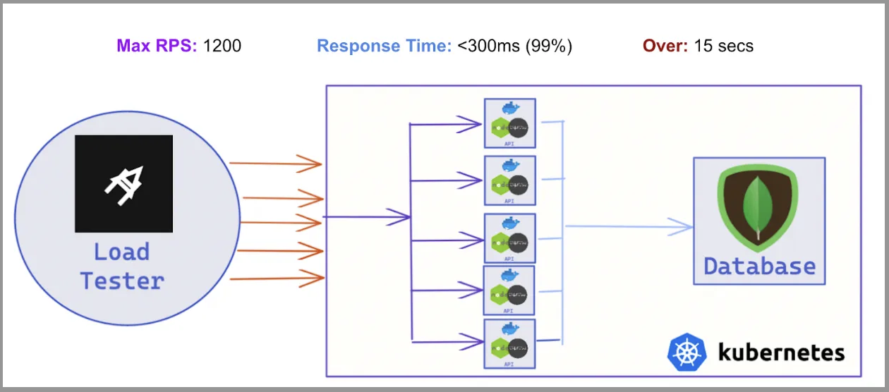

# LaaS API Load Testing

Load-testing setup for the Node.js / Express REST API. Deployed with Kubernetes + Docker, and tested locally with [Artillery](https://www.artillery.io/)

## Folders

- `<parent folder>`: the main Node/Express REST API, connected to MongoDB
- `kubernetes-local`: files and documentation for running a local K8 cluster (minikube)
- `artillery-load-tester`: configuration and documentation preforming an Artillery load-test on local machine (against the Docker/Kubernetes cluster)

## Experiments

- `auth-service`: Docker-ized Node/Express REST API for JWT authentication and user/pass registration (saved in MongoDB)
- `gateway-service`: light-weight Node/Express proxy API (with rate-limiting)
